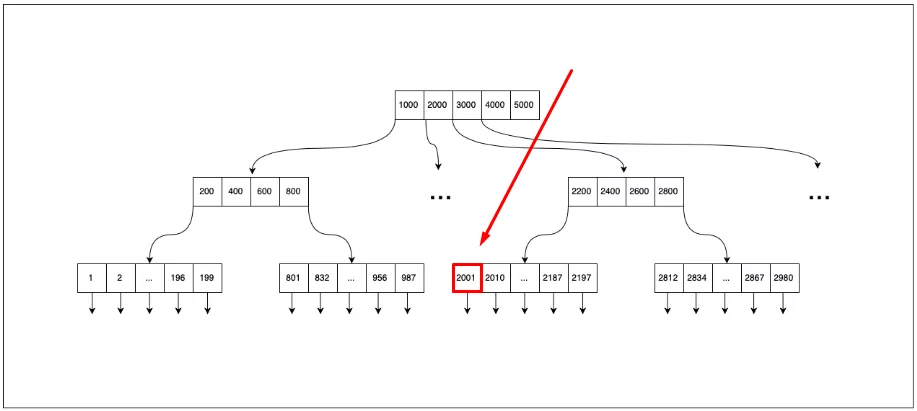

# 📎 Индексы в таблицах


**Индексирование баз данных** — это техника, повышающая скорость и эффективность запросов к базе данных. Она создаёт отдельную структуру данных, сопоставляющую значения в одном или нескольких столбцах таблицы с соответствующими местоположениями на физическом накопителе, что позволяет базе данных быстро находить строки по конкретному запросу без необходимости сканирования всей таблицы.&#x20;


Применяются разные типы индексов, однако они занимают пространство и должны обновляться при изменении данных. Важно тщательно продумывать стратегию индексирования базы данных и регулярно её оптимизировать.

### Алгоритмы индексирования

\
Как говорилось выше, существует множество алгоритмов индексирования, используемых для оптимизации скорости операций получения данных при помощи создания индексов столбцов таблиц. Вот некоторые из самых популярных алгоритмов индексирования баз данных:

* B-дерево
* Bitmap-индекс
* Хэш-индекс
* GiST (Generalized Search Tree, обобщённое поисковое дерево)
* Полнотекстовый индекс

Рассмотрим самый простой и распростаненный способ индексирования - В-дерево.

## B-дерево

Перед нами B-дерево индекса, присвоенного полю в таблице (которое чаще всего используется при выборках). В каждом узле хранятся элементы со значениями.Также элементы хранят ссылку на строку в таблице.

<figure><figcaption>
Поиск значения 2001
</figcaption></figure>

Поиск начинается с корневого узла. Наша задача — пройти по каждому элементу в узле и сравнить его значение с искомым:

* Если значение совпало — берём ссылку на данные и читаем их из таблицы.
* Если наше значение больше, чем значение в элементе, — идём дальше.
* Если искомое значение меньше, чем в элементе, — нам нужно перейти в поддерево, которое хранится левее от ячейки. Далее мы попадаем на следующий уровень и итерация повторяется.

Рассмотрим алгоритм на примере поиска значения 2001.

* Как и говорилось ранее, мы начинаем с корневого узла — первой ячейки со значением 1000.
* Так как 2001 больше 1000, то мы идём дальше.
* Доходим до ячейки 3000. Но 2001 меньше, чем 3000, поэтому переходим на поддерево.
* Первая ячейка идёт со значением 2200, наше значение меньше, значит снова переходим на левое поддерево.
* И сразу же находим ячейку со значением 2001.

То, что мы и искали. А так как искомая ячейка содержит ссылку на место, где лежат наши данные, то мы можем легко и быстро прочитать их.

Источник:

* [https://habr.com/ru/companies/ruvds/articles/724066/](https://habr.com/ru/companies/ruvds/articles/724066/)
* [https://skillbox.ru/media/code/kak\_uskorit\_bazu\_dannykh\_s\_pomoshchyu\_indeksov/](https://skillbox.ru/media/code/kak\_uskorit\_bazu\_dannykh\_s\_pomoshchyu\_indeksov/)
