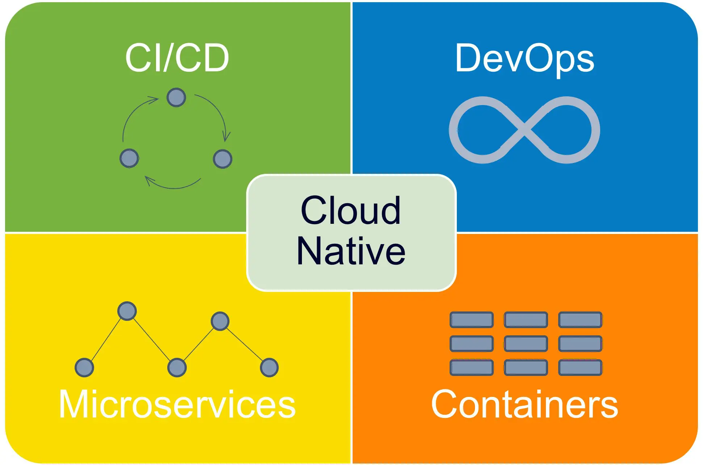

# Cloud Native


**Cloud Native** - это подход к созданию и запуску приложений, использующий преимущества облачных систем. Cloud Native разработка включает в себя концепции DevOps, continuous delivery, микросервисов и контейнеров. Компании, которые используют cloud native архитектуру, чаще создают новые идеи, понимают тенденции рынка, и быстрее реагируют на запросы своих клиентов.


## Принципы Cloud Native

<figure><figcaption>
Принципы Cloud Native
</figcaption></figure>

Для создания и использования cloud native приложений организациям необходимо переосмысливать подход к системе разработки и внедрять основополагающие принципы cloud native.

### **DevOps**&#x20;

**DevOps** - это концепция взаимодействия между разработчиками программного обеспечения и ИТ-отделами, с целью предоставления высококачественного продукта. DevOps создает культуру и среду, в которой создание, тестирование и выпуск программного обеспечения происходит быстрее, чаще и более последовательно.

### CI/CD

**Continuous Delivery** - это процесс постоянного добавления различных изменений и обновлений в разработку продукта, в том числе с помощью автоматизации. Непрерывная поставка делает процесс выпуска ПО надежным и проверенным, а организации могут поставлять отдельные обновления, фичи или целые продукты в более короткие сроки.

Подробнее об этом процессе можно почитать в статье из блока про "DevOps for SA/Развертывание приложений":


[ci-cd.md](../razvertyvanie-prilozhenii/ci-cd.md)


### **Микросервисы**&#x20;

**Микросервисы** - это архитектурный подход к разработке приложения как совокупности небольших сервисов; каждый сервис реализует бизнес-возможности, запускает свой собственный процесс и общается через свои API или сообщения. Каждый микросервис может быть развернут, модернизирован, масштабирован и перезапущен независимо от других сервисов в том же самом приложении, обычно как часть автоматизированной системы, позволяя частые обновления живых приложений без воздействия на клиентов.

Подробнее об этом процессе можно почитать в статье из блока про "Проектирование/Архитектура":


[mikroservisy](../../proektirovanie/arkhitektura/mikroservisy/)


### **Контейнеризация**&#x20;

**Контейнеризация** - это программная виртуализация на уровне операционной системы, которая обеспечивает запуск приложений и требуемый ему минимум ресурсов в некоем стандартизированном пространстве (Контейнер). Используя виртуализацию на уровне операционной системы, один экземпляр ОС динамически разделяется на один или несколько изолированных контейнеров, каждый из которых имеет уникальную файловую систему с возможностью записи и квоту ресурсов. Низкие накладные расходы на создание и удаление контейнеров в сочетании с высокой плотностью упаковки в одной ВМ делают контейнеры идеальным вычислительным средством для развертывания отдельных микросервисов.

Подробнее об этом процессе можно почитать в статье из блока про "DevOps for SA/Развертывание приложений":


[docker.md](../razvertyvanie-prilozhenii/middle+/virtualizaciya-konterizaciya/docker.md)


### **Преимущества использования облачных платформ**

1. **Масштабируемость**. При использовании облачных ресурсов масштабируемость выполняется автоматически, что значительно упрощает разработку систем, которые самостоятельно адаптируются под запросы бизнеса.
2. **Надёжность**. Cloud-native-приложения будут продолжать стабильно работать при частичном или полном выходе из строя внутренних и внешних компонентов. В случае возникновения неполадок облачные сети автоматически перейдут на исправные звенья.
3. **Ускорение**. Приложения можно разделить на множество мелких частей, которые будут разрабатываться независимо друг от друга. Это способствует ускоренному выводу продукта к потребителю, так как процессы тестирования и изменения товара или услуги под пожелания клиента протекают быстрее.
4. **Open-source.** Основа многих Cloud Native — одинаковые open-source-технологии, поэтому различные облачные среды можно успешно совмещать друг с другом. В результате компоненты, приложения и ландшафты вполне реально переносить между облаками с минимальными усилиями. Так появляется возможность создавать multicloud-приложения.
5. **Оптимизация**. Гибкая архитектура приложений даёт возможность сократить потребление ресурсов, подстраивая их под непосредственные потребности в конкретный период времени.

Источники:&#x20;

* [https://sber.pro/digital/publication/chto-takoe-cloud-native-i-zachem-biznesu-vnedryat-etot-podhod/](https://sber.pro/digital/publication/chto-takoe-cloud-native-i-zachem-biznesu-vnedryat-etot-podhod/)
* [https://denovo.ua/ru/blog/cloud-native-apps](https://denovo.ua/ru/blog/cloud-native-apps)
* [https://www.systemcraftsman.com/2020/05/20/system-craftsmanship-software-craftsmanship-in-the-cloud-native-era/](https://www.systemcraftsman.com/2020/05/20/system-craftsmanship-software-craftsmanship-in-the-cloud-native-era/)

