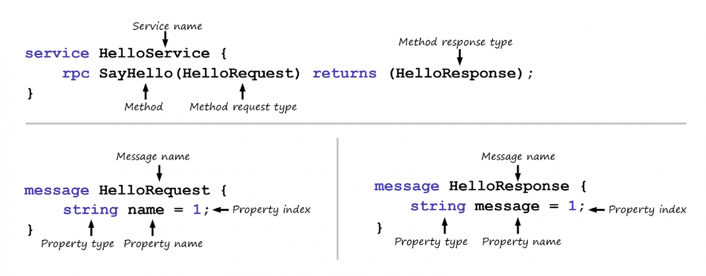

# Правила proto-контракта


**Контракт** — это набор методов, объединенных в сервисы. Описание метода состоит из названия, сообщения запроса и сообщения ответа. В запросе и ответе можно как указать стандартные типы данных, так и составить свой объект с необходимым наполнением. Во втором случае потребуется придумать ему название и описать с ключевым словом message.


## **Правила, по которым строится запрос**

<figure><figcaption><p>Состав сервиса, метода и сообщения</p></figcaption></figure>

* Метод должен принимать что-то на вход и возвращать что-то на выходе — HelloRequest и HelloResponse. Если не нужно получать или отправлять какие-то данные, их можно заменить пустым значением google.protobuf.Empty. Тогда в ответ на запрос или в запросе не будут отправляться никакие данные, но придет код ответа. Ответ 2хх, если все успешно, или 4хх/5хх, если есть проблемы. Это позволяет снизить нагрузку на систему и повысить безопасность, передавая только самое необходимое.
* В методе должны быть указаны типы данных, которыми он оперирует. В примере выше это string для name и message, а также HelloRequest и HelloResponse для самого запроса. Если тип данных заранее неизвестен, можно использовать google.protobuf.Any, который заменяет любой тип данных.&#x20;
* У поля в сообщении должен быть неповторяющийся порядковый номер. Если какое-то поле было использовано ранее и удалено, этот номер повторно использовать нельзя. Такие поля можно резервировать ключевым словом reserved или оставляя комментарии.&#x20;

Для описания контракта используются ключевые слова:

* `‘syntax’` — текущая версия синтаксиса. Сейчас, как правило, новые сервисы пишутся на proto3.
* `‘import’` — для импорта стандартных пакетов. Например, “google/protobuf/timestamp.proto” загрузит тип данных timestamp.
* `‘service’` — для объявления сервиса. В сервис объединяют GRPC-методы
* `‘rpc’` — для объявления метода: его названия и request-сообщения.
* `‘returns’` — для объявления ответа метода, response-сообщения.
* `‘message’` — для объявления объекта.
* `‘enum’` — для объявления перечисления.
* `‘repeated’` — для объявления повторяющегося поля.
* `‘reserved’` — для резервирования поля.
* `‘optional’` или `‘required’`  — для объявления необязательного или обязательного поля. В proto3 этот функционал убран.
* `‘oneof’` — для объявления сложного поля, в котором можно получить одно из нескольких значений. Это довольно нагруженная и сложно обрабатываемая конструкция, которая может много весить и тратить кучу ресурсов, поэтому ее лучше не использовать, а заменить на что-нибудь другое. Например, на строку, в которой придет на самом деле json.&#x20;
* Целый набор стандартных типов данных вроде bool, string, int64 и других.

<details>

<summary>Пример proto-контракта</summary>

```protobuf
syntax = "proto3";
import "google/protobuf/any.proto";
import "google/protobuf/empty.proto";
import "google/protobuf/timestamp.proto";

 
service ProductService{
	// метод добавления книги в каталог
	rpc AddProduct(AddProductRequest) returns (google.protobuf.Empty) {}
    // метод получения книги по ID
	rpc GetProductById(GetProductByIdRequest) returns (GetProductByIdResponse) {}
    // метод получения всех книг
	rpc GetProductsList(GetProductsListRequest) returns (GetProductsListResponse) {}
}

message AddProductRequest{
	BookInfo add_book_info = 1;

}

message BookInfo{
	// эти поля нельзя будет использовать
	reserved 6, 15, 9 to 11;
	// данные об авторе не определены однозначно, и может прийти любой тип (строка или массив, например)
	google.protobuf.Any author = 1;
	string name = 2;
	int32 price = 3;
	Type type = 4;
	bool in_store = 5;
	// в типе bytes можно передавать файлы, но лучше заменить на ссылку в s3
	bytes book_cover = 7;
	// здесь мы будем использовать только одно из перечисленных полей,
	// для пользователя это выглядит как, например, динамичная форма ввода
	oneof additional_fields{
        // используем с TYPE_UNDEFINED — он пригодится, 
        // когда будут добавляться новые значения в enum Type: созданные объекты BookInfo примут этот тип по умолчанию
    	AdditionalFieldsUndefined additional_fields_undefined = 8;
    	AdditionalFieldsDetective additional_fields_detective = 12;
    	}
}

enum Type{
	TYPE_UNDEFINED = 0;
	TYPE_DETECTIVE = 1;
}

message AdditionalFieldsUndefined{
	string description = 1;
}

message AdditionalFieldsDetective{
	string description = 1;
	string period = 2;
}

message GetProductByIdRequest{
	// protobuf еще не знает, что такое uuid, поэтому его можно передать типами string, bytes или кастомным типом
	string id = 1;
}

message GetProductByIdResponse{
	string id = 1;
	BookInfo get_book_info = 2;
	google.protobuf.Timestamp created_at = 3;
}

// limit и offset нужны для пагинации на бэке. Если у нас бесконечная лента, можно вместо объекта GetProductsListRequest передать google.protobuf.Empty
message GetProductsListRequest{
	int32 limit = 1;
	int32 offset = 2;
}

message GetProductsListResponse{
	repeated BookInfo get_book_list_info = 1;
}
```

</details>


Источник: [https://habr.com/ru/companies/tinkoff/articles/780024/](https://habr.com/ru/companies/tinkoff/articles/780024/)
