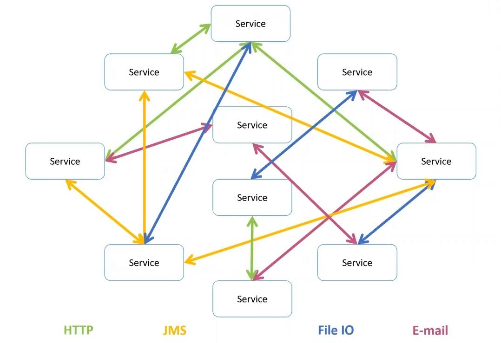
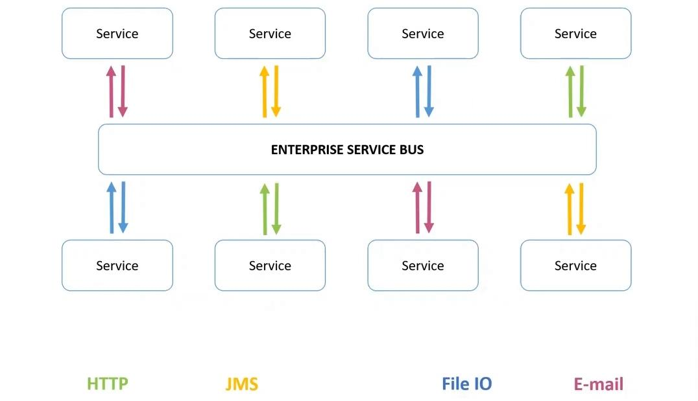

# ESB


**Корпоративная сервисная шина (ESB)** представляет собой промежуточное программное обеспечение, обеспечивающее интеграцию различных приложений и систем в единую информационную среду. ESB служит для передачи данных между компонентами, выполнения преобразования данных в соответствии с требуемыми форматами и обеспечения унификации коммуникаций.


## Принцип работы

Сервисная шина управляет потоком информации, автоматически настраивает передачу данных, задает маршруты, осуществляет прием данных из одного приложения и отправку в другое. Информация из разных хранилищ представляется в корпоративном сервисе в различных форматах (протоколах), например, в DBF, JSON, CSV, XML и т.д. Взаимодействие приложений при обычной схеме обмена данными серьезно затруднено. Шина ESB автоматически преобразует информацию в подходящий формат(ы)(протокол(ы)) и отправляет в соответствующую систему (или разные системы).

<figure><figcaption>
Обычная схема данными
</figcaption></figure>

<figure><figcaption>
ESB схема обмена данными
</figcaption></figure>

## Основные компоненты

* **Брокер сервисов:** Управляет доступом к сервисам, регистрируя их и обеспечивая безопасность взаимодействия.
* **Адаптеры:** Предоставляют соединение с различными приложениями или системами, адаптируя их интерфейсы для работы в рамках ESB.
* **Мониторинг и управление:** Компоненты, предоставляющие инструменты для наблюдения за работой ESB, отслеживания производительности, обработки ошибок и административного управления.

ESB архитектура представляет собой слой, расположенный между коммуницирующими системами. Вместо того чтобы каждая система взаимодействовала напрямую с другими, все обмены информацией происходят через ESB, что обеспечивает стандартизацию, контроль и унификацию процессов.

## Преимущества

* **Упрощение интеграционных процессов:** Вместо многочисленных прямых интеграций между системами ESB предлагает стандартизированный подход, сокращая время и ресурсы, необходимые для внедрения новых связей.
* **Гибкость:** ESB позволяет легко добавлять, модифицировать или удалять системы без необходимости изменения основного кода, что делает архитектуру более адаптивной к изменениям.
* **Масштабируемость:** С ростом компании и появлением новых систем ESB способна масштабироваться, обеспечивая надежное и стабильное взаимодействие между большим количеством компонентов.
* **Улучшение качества данных:** С помощью ESB можно обеспечить контроль и преобразование данных, устраняя несоответствия и ошибки при передаче информации.
* **Снижение рисков:** Централизованный подход к интеграции через ESB уменьшает вероятность ошибок и сбоев, связанных с прямыми связями между системами
* **Экономия ресурсов:** ESB уменьшает необходимость в постоянной разработке и поддержке индивидуальных интеграций, что может существенно снизить IT-затраты организации.

## Недостатки

* **Сложность интеграции:** Несмотря на то что ESB призвана облегчить интеграцию систем, начальные этапы внедрения могут потребовать значительных затрат времени и ресурсов, особенно в сложных и фрагментированных IT-средах.
* **Зависимость от одного решения:** Если все интеграционные процессы привязаны к одной ESB-платформе, возможные сбои или проблемы в её работе могут парализовать деятельность всей компании.
* **Производительность:** В ситуациях с большим объемом данных и множеством транзакций ESB может стать узким местом, замедляя обработку данных.
* **Сложности масштабирования:** При росте бизнеса и увеличении числа интегрированных систем может потребоваться дополнительное масштабирование ESB, что влечет за собой дополнительные затраты.
* **Безопасность:** Так как ESB становится центральным звеном между множеством систем, она может стать целью для кибератак. Необходимо внимательно следить за обновлениями безопасности и регулярно проводить аудиты.
* **Стоимость и ресурсы:** Поддержка и обслуживание ESB может потребовать значительных инвестиций, как финансовых, так и в плане человеческих ресурсов.

Источники:&#x20;

* [https://vc.ru/u/957470-dynamicsun/514376-chto-takoe-integracionnaya-shina-esb](https://vc.ru/u/957470-dynamicsun/514376-chto-takoe-integracionnaya-shina-esb)
* [https://habr.com/ru/companies/mygames/articles/671496/](https://habr.com/ru/companies/mygames/articles/671496/)
* [https://www.decosystems.ru/esb-integratsiya/](https://www.decosystems.ru/esb-integratsiya/)
