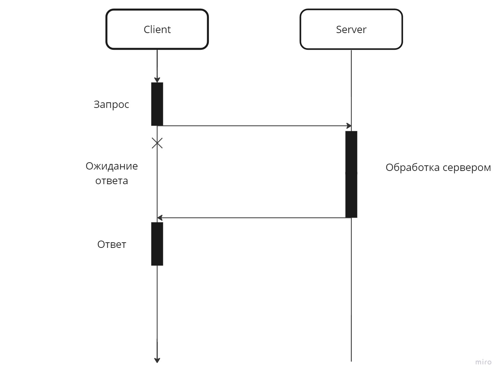

# Синхронное взаимодействие


**Cинхронное взаимодействие** — это способ организации взаимодействия между компонентами программной системы, при котором клиент, отослав запрос, блокируется и может продолжать работу только после получения ответа от сервера.


<figure><figcaption>
Синхронное взаимодействие
</figcaption></figure>

## API


**API (Application Programming Interface)** - это набор правил, которые позволяют двум приложениям или системам взаимодействовать друг с другом. Он определяет, каким образом программы могут обмениваться данными, запрашивать услуги и взаимодействовать с другими сервисами. API позволяет разным программам работать вместе, как если бы они были частью одного целого.


## Виды API

&#x20;Всего есть 4 общепринятых типа построения API:

1. **SOAP (Simple Object Access Protocol)** — это протокол для обмена структурированными сообщениями между веб-сервисами. Он использует формат данных XML для кодирования сообщений. SOAP применяется в распределенных системах и веб-сервисах для взаимодействия между клиентами и серверами. Сегодня SOAP встречается не так часто, так как XML довольно громоздкий, а сама архитектура SOAP не гибкая.
2. **RPC (Remote Procedure Call) API** — это метод взаимодействия между компонентами распределенной системы, позволяющий вызывать функции на удаленном сервере, как будто они являются локальными. Формат данных в RPC может быть разным, включая XML, JSON и бинарные форматы. RPC API применяется в распределенных системах для обеспечения совместной работы между клиентами и серверами с минимальными задержками.
3. **WebSocket API** — это двунаправленный протокол связи, позволяющий установить постоянное соединение между клиентом и сервером для обмена данными в режиме реального времени. Формат данных в WebSocket может быть текстовым или бинарным, включая JSON, XML и другие. WebSocket API часто используется в веб-приложениях для обмена сообщениями между сервером и браузером пользователя, например, в онлайн-играх, чатах или приложениях для обмена данными в реальном времени.
4. **REST (Representational State Transfer) API** — это архитектурный стиль для разработки веб-сервисов, основанный на стандартных HTTP-методах и ресурсоориентированном подходе. Формат данных в REST API может быть разнообразным, включая JSON, XML и другие. REST API широко применяется в веб-приложениях и мобильных приложениях для обеспечения межсистемного взаимодействия и интеграции с различными сервисами и платформами.

Наибольшее распространение получил REST формат API, так как он наиболее прост для разработки и понятен для пользователей.

Источники:&#x20;

* [https://1cloud.ru/blog/intoduction\_in\_api\_and\_restapi](https://1cloud.ru/blog/intoduction\_in\_api\_and\_restapi)
* [http://js.programs.kodika.school/05\_rest\_api/](http://js.programs.kodika.school/05\_rest\_api/)
