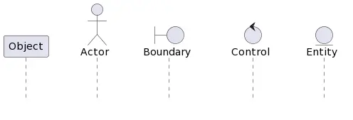

# Диаграмма последовательности


**Диаграммы последовательностей UML** — это диаграммы взаимодействия, подробно описывающие выполнение операций. Они фиксируют взаимодействие между объектами в контексте сотрудничества. Диаграммы последовательности ориентированы на время и визуально показывают порядок взаимодействия, используя вертикальную ось диаграммы для представления времени, какие сообщения отправляются и когда.


## Назначение диаграммы последовательности

* Моделируйте высокоуровневое взаимодействие между активными объектами в системе.
* Моделируйте взаимодействие между экземплярами объектов в рамках сотрудничества, реализующего вариант использования.
* Моделируйте взаимодействие между объектами в рамках сотрудничества, реализующего операцию.
* Либо смоделируйте общие взаимодействия (показывая все возможные пути взаимодействия), либо конкретные случаи взаимодействия (показывая только один путь взаимодействия).

### Элементы диаграммы последовательности 

Диаграмма состоит из вертикальных линий жизни и горизонтальных стрелок. Линии представляют отдельные объекты, а горизонтальные стрелки — сообщения и операции, передаваемые между объектами или участниками.

При необходимости на диаграмме также указывают активации, фреймы, условные операторы, итерации и тайм-ауты. Они помогают уточнить логику взаимодействия объектов и участников системы. Кроме того, диаграмма может включать комментарии и примечания, чтобы объяснить процесс взаимодействия более подробно.

### Объекты 

В диаграмме объектами выступают участники системы, такие как акторы (Actor), границы (Boundary), контроллеры (Control) и сущности (Entity). Они называются участниками (Participants) и отображаются в виде пиктограмм или прямоугольника с названием.

**Акторы (Actor)** представляют пользователей или другие системы, взаимодействующие с системой, которая описывается на диаграмме. Они могут вызывать действия, которые система выполняет в ответ на их запросы. Например, актор может запросить у системы информацию и получить ответ.

**Границы (Boundary)** определяют внешние границы системы и представляют собой точки входа или выхода, через которые система взаимодействует с внешним миром. Например, граница может представлять интерфейс пользователя, через который пользователь взаимодействует с системой.

**Контроллеры (Control)** обрабатывают запросы и управляют потоком данных в системе. Они представляют собой узлы, через которые проходят данные и управляющие выполнением операций в системе. Например, контроллер может обрабатывать запросы, которые поступают от акторов и возвращать результаты.

**Сущности (Entity)** представляют данные и хранят состояние системы. Они могут быть представлены как базы данных или другие системы хранения данных. Например, сущность может обрабатывать запросы на чтение или запись данных.

<figure><figcaption>
Объекты на диаграмме последовательностей
</figcaption></figure>

Каждый объект на диаграмме представлен вертикальной линией жизни, отображающей период времени, когда объект существует и выполняет операции. Кроме того, объекты могут содержать дополнительную информацию, такую как поля или состояния объекта, которые передаются между объектами в сообщениях.

### Линия жизни

Линия жизни (lifeline) — это вертикальная линия на диаграмме последовательности UML, которая представляет объект или участника взаимодействия и связывает его с сообщениями во времени. Линия жизни начинается с появления объекта на диаграмме и продолжается до его удаления или окончания взаимодействия.

На линии указываются различные элементы, такие как активности, состояния и метки времени, помогающие уточнить временные параметры взаимодействия объектов.

Линия жизни является основным элементом на диаграмме последовательности, который помогает визуализировать хронологию взаимодействия в системе.

### Сообщения 

#### **Мгновенные и не мгновенные сообщения**

**Мгновенные сообщения** применяются в тех случаях когда временем затраченным на доставку можно пренебречь. Они отображаются на диаграмме в виде горизонтальных стрелок, соединяющие объекты между собой. Стрелки направлены от отправителя к получателю, содержат метку с именем метода или функции.

**Не мгновенные сообщения**, как следует из их названия, не могут быть переданы мгновенно, а требуют определенного времени на передачу и обработку. Не мгновенные сообщения применяются в тех случаях, когда время, затраченное на передачу, имеет значение для последовательности действий. Например, в случае, когда передача данных между двумя системами занимает определенное время, необходимо учитывать это время при моделировании процесса.

Отображение не мгновенного сообщения на диаграмме последовательности происходит с помощью наклонной стрелки. Она показывает разницу во времени между отправкой и получением сообщения. Эта стрелка начинается с точки отправления сообщения на линии жизни отправителя и заканчивается на линии жизни получателя, смещенной вправо относительно точки отправления. Наклон стрелки показывает длительность, которая может быть задокументирована или не задокументирована.

#### **Синхронные и асинхронные сообщения**

**Синхронные сообщения** — это сообщения, блокирующие отправителя до тех пор, пока получатель не ответит на него. Они применяются в тех случаях, когда отправитель ожидает ответа от получателя, прежде чем продолжить выполнение своей работы. Синхронные сообщения отображаются на диаграмме с помощью сплошной линии с закрашенной стрелкой, которая начинается у отправителя и заканчивается у получателя. На этой стрелке указывается имя сообщения и/или аргументы.

**Асинхронные сообщения** — это сообщения, которые отправляются без ожидания ответа от получателя. Они используются, когда отправитель не должен блокировать свою работу, чтобы ждать ответа. Обычно они отображаются на диаграмме с помощью сплошной линии с открытой стрелкой.

При использовании асинхронных сообщений может возникнуть необходимость в других элементах для управления асинхронными процессами. Например, отправитель может активировать другую операцию или объект, который должен обработать сообщение, и затем продолжить свою работу независимо от того, завершится ли обработка в текущей операции или нет.

### Комментарии 

Объект «комментарии» — это специальный элемент, который используется для добавления дополнительной информации на диаграмму. Комментарии могут взаимодействовать с другими объектами на диаграмме. Они просто содержат текстовую информацию и могут использоваться для пояснения, объяснения или уточнения элементов диаграммы.

Комментарии изображаются в виде прямоугольника, внутри которого находится текст. Они связаны со своими целевыми элементами путем использования пунктирной линии или стрелки.

Комментарии используются в различных случаях. Например, для объяснения сложных элементов, для документирования принятых решений или для отображения дополнительной информации, которая не имеет места в структуре самой диаграммы.

Пример использования комментариев на диаграмме может быть связан с объяснением назначения или цели любого элемента на диаграмме. Комментарии также используются для пояснения временных ограничений или других деталей, связанных с последовательностью действий.

## Как построить диаграмму последовательности 

Диаграмма последовательности представляет собой визуальное представление потока событий, которые происходят в рамках конкретного сценария использования. Ее основа — это описание конкретного случая использования. Он определяет какие объекты участвовать в процессе и как они будут взаимодействовать.

Перед началом построения диаграммы важно подготовить сценарии использования. Далее следует определить объекты или агенты, которые будут участвовать в процессе. Затем необходимо написать подробное описание того, что происходит в конкретном сценарии использования. На основе этого описания можно выявить взаимодействия, которые будут происходить в системе.

Источники:

* [https://www.visual-paradigm.com/guide/uml-unified-modeling-language/what-is-sequence-diagram/](https://www.visual-paradigm.com/guide/uml-unified-modeling-language/what-is-sequence-diagram/)
* [https://itonboard.ru/analysis/394-diagramma\_posledovatelnosti\_sequence\_diagrams\_uml/](https://itonboard.ru/analysis/394-diagramma\_posledovatelnosti\_sequence\_diagrams\_uml/)
