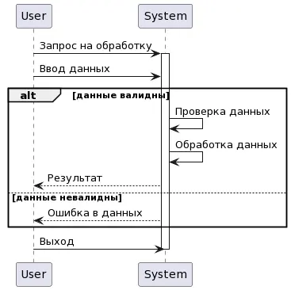
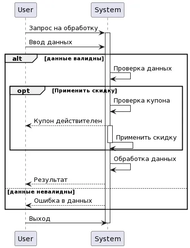
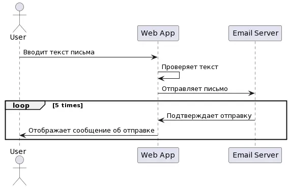
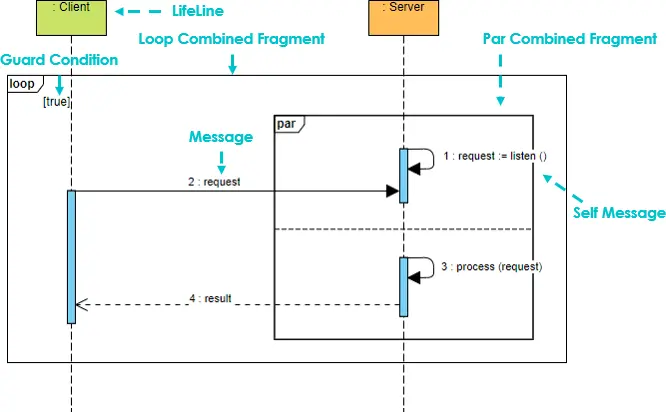
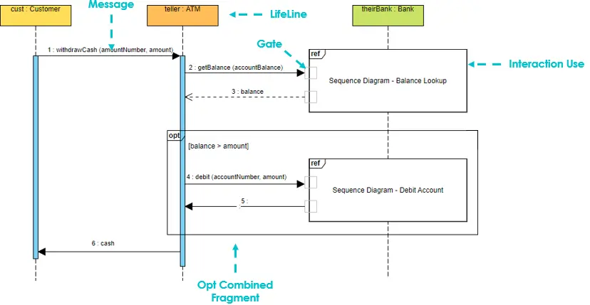
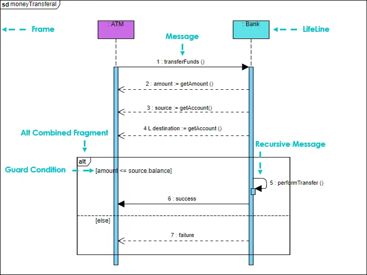

# Фреймы


**Фреймы** — это структурированные блоки, которые используются для организации группы сообщений в логически связанные последовательности.


## **Фрейм Alt**

На диаграмме последовательности фрейм `alt` используется для представления условного оператора, позволяющего определить две или более взаимоисключающие альтернативы выполнения действий в зависимости от условия. Он может содержать один или несколько блоков альтернатив.

<figure><figcaption>
Пример фрейма alt на диаграмме последовательности
</figcaption></figure>

Блок альтернативы представляет собой условный блок, содержащий один или несколько сообщений. Каждый блок альтернативы имеет свое условие, которое должно быть истинным для того, чтобы блок выполнился. Если условие блока не истинно, то блок пропускается.

На диаграмме фрейм `alt` строится с помощью ключевых слов `alt`, `else` и `end` и отображается в виде горизонтального прямоугольника, разделенным пунктирной линией на несколько блоков альтернатив. Код, расположенный между `alt` и `else`, описывает условие, при котором нужно выполнить определенный блок действий. Код, расположенный между `else` и `end`, описывает действия, которые нужно выполнить, если условие не выполнено.

## **Фрейм Opt**

Фрейм `opt` (от «optional», на русском «необязательный») — позволяет указать, что определенные сообщения являются необязательными. Таким образом, если условие выполняется, то сообщение отправляется, а если нет, то сообщение не отправляется.

<figure><figcaption>
Пример фрейма opt на диаграмме последовательности
</figcaption></figure>

Фрейм `opt` используется, когда выполнение какой-то части последовательности необязательно и может быть пропущено, если не выполняется определенное условие. Например, процесс покупки товара онлайн,он может использоваться для отображения условия наличия купона на скидку. Если купон есть, то будет отправлено сообщение для применения скидки, а если нет, то этот шаг может быть пропущен.

На диаграмме он отображается как прямоугольник, содержащий условие в квадратных скобках. Если условие выполняется, то соответствующее сообщение будет отправлено, иначе он будет пропущен.

## **Фрейм Loop**

Фрейм `loop` на диаграмме последовательности используется для описания повторяющегося процесса или цикла. Он указывает, что определенная последовательность действий должна быть выполнена несколько раз, пока не будет выполнено определенное условие.

<figure><figcaption>
Пример фрейма loop на диаграмме последовательности
</figcaption></figure>

Ключевое слово «loop» указывает на начало цикла, а «end loop» — на его конец. Условие, которое указывается в квадратных скобках, определяет, когда цикл должен завершиться.

Фрейм «loop» отображается в виде прямоугольника, внутри которого располагается последовательность действий, которые должны быть выполнены в рамках цикла. В верхней части прямоугольника указывается условие завершения цикла.

## **Фрейм Par**

Фрейм `par` (parallel) используется на диаграммах для отображения параллельных процессов, которые происходят одновременно и независимо друг от друга. Он позволяет разделять диаграмму на несколько потоков выполнения, которые могут выполняться параллельно.

<figure><figcaption>
Пример фрейма par на диаграмме последовательности
</figcaption></figure>

Фрейм `par` представляется как прямоугольник, внутри которого располагаются стрелки, отображающие процессы, выполняющиеся параллельно. Каждый из этих процессов представлен в виде своей собственной последовательности шагов и взаимодействий.

## **Фрейм Neg**

Фрейм `neg` (или Negative Frame) на диаграмме используется для представления альтернативной сценарной ветки, которая не должна происходить в системе. То есть он используется для описания ошибок или невозможных сценариев.

На диаграмме фрейм `neg` отображается в виде прямоугольника, с диагональной чертой, разделяющей область выполнения на две части. Фрейм `neg` может содержать вложенные элементы, такие как сообщения, объекты, а также другие фреймы.

## **Фрейм Ref**

На диаграмме фрейм `Ref` (Reference) используется для ссылки на другую диаграмму или фрагмент кода, который описывает детали процесса внутри данного фрейма. Он позволяет вынести подробную информацию на отдельную диаграмму, упрощая основную диаграмму и делая её более читабельной.

<figure><figcaption>
Пример фрейма ref на диаграмме последовательности
</figcaption></figure>

## **Фрейм SD**

На диаграмме последовательности фрейм `SD` (Sequence Diagram) позволяет очертить всю диаграмму и указать ее имя. Обычно используется если на диаграмму ссылается другая диаграмма.

<figure><figcaption>
Пример фрейма sd на диаграмме последовательности
</figcaption></figure>

Источники:&#x20;

* [https://itonboard.ru/analysis/394-diagramma\_posledovatelnosti\_sequence\_diagrams\_uml/](https://itonboard.ru/analysis/394-diagramma\_posledovatelnosti\_sequence\_diagrams\_uml/)
* [https://www.visual-paradigm.com/guide/uml-unified-modeling-language/what-is-sequence-diagram/](https://www.visual-paradigm.com/guide/uml-unified-modeling-language/what-is-sequence-diagram/)
