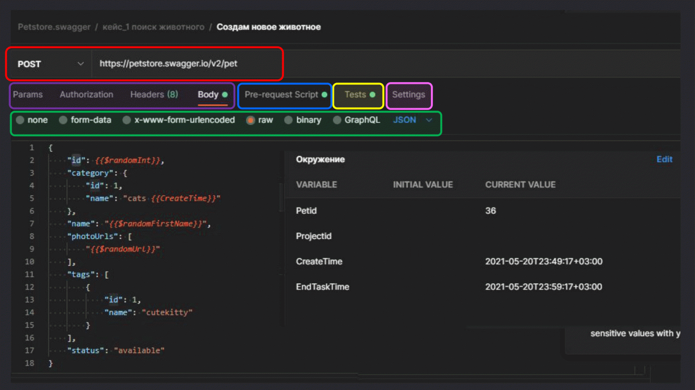
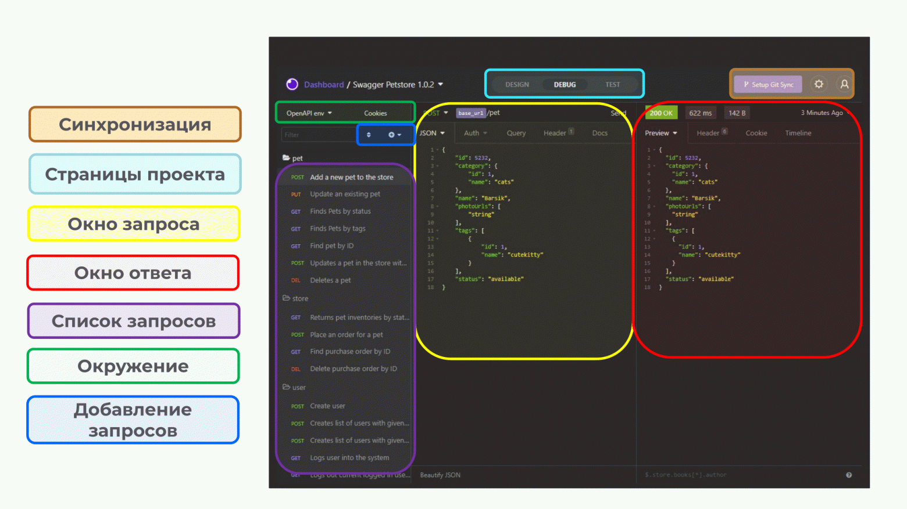

# Postman | Insomnia

## API-клиенты&#x20;

Инструменты среднего уровня сложности. Это, как правило, десктопные приложения, которые позволяют обратиться к эндпойнтам. Также они предоставляют дополнительные возможности — использование переменных, рандомайзеров, скриптов и других функций.&#x20;

## Postman&#x20;

Очень популярный API-клиент. Хоть его интерфейс и пугает насыщенностью, разобраться в нем достаточно просто. На домашней странице предлагается выбрать рабочее пространство. Это своеобразная «папка», в которую добавляются коллекции запросов, окружения, переменные, мок-заглушки и другое. Такое разделение очень удобно, если у вас есть несколько тестируемых проектов или сервисов.

Окно запроса состоит из поля для указания HTTP-метода и URL запроса, настройки параметров (заголовки и тело), Pre-request Script — скриптов, которые будут исполняться до отправки сообщения, Tests — кода, который будет исполняться после выполнения запроса.

<figure><figcaption>
Функционал Postman
</figcaption></figure>

### Достоинства

1. Относительно простой интерфейс.&#x20;
2. Возможность подключения в Swagger.
3. Возможность создавать рабочие пространства и коллекции.&#x20;
4. Поддержка мок-серверов и прогонов коллекций (ручные и периодические).
5. Отдельный компонент-перехватчик запросов.&#x20;
6. Окружения, переменные и возможность их настраивать, создавать, редактировать.
7. Возможность тестирования разных видов API, таких как REST, SOAP и т.д.&#x20;
8. Поддержка интеграции с Git.

### Недостатки

1. Коллекции и окружения к ним экспортируются отдельно.
2. Невозможен параллельный запуск кейсов в Postman. Например, вы тестируете асинхронный сервис и есть некий этап ожидания между созданием задания и получением на него результата. В этом случае лучше, чтобы ваш инструмент тестирования позволял запускать проверки параллельно и ждать результата в каждом случае по отдельности. Иначе вы будете ждать их очень долго, особенно когда много тест-кейсов. Прогон такой коллекции будет растянутым.
3. Раннер, который последовательно запускает запросы, видит именно список запросов, а не кейсы. Это несет в себе риски, когда кейс состоит из нескольких запросов. Например, папка представляет собой тест-кейс. У вас десять папок, в которых десять тест-кейсов, и в каждом по два-три шага. Когда запускаете раннер, вам видны 30 последовательных запросов. Поэтому в некоторых запросах в разных тест-кейсах вам нужно писать скрипты, которые в случае провала автоматически очистят некоторые переменные от своих значений. Тогда следующий кейс пройдет без ошибок и там не останется значений, которые не воспринимаются следующим кейсом. Это влияет на независимость тест-кейсов друг от друга.

### Когда использовать

**Postman следует использовать**, когда вам нужен удобный и мощный API-клиент для тестирования разных видов API с возможностью использовать продвинутые переменные и скрипты в запросах. При этом не важен параллельный запуск кейсов в вашем проекте и вы понимаете особенности построения кейсов из нескольких запросов.

## Insomnia

Insomnia поддерживает широкий набор возможностей для обращений к различным API: набор методов HTTP/s, обращения к gRPC API, а также кастомные методы со своими параметрами. Вариантов форматов передаваемых сообщений тоже много: JSON, XML, YAML, EDN, бинарные файлы, GraphQL Query.

Важная особенность Insomnia — возможность **создавать переменные окружения**, которые будут подтягиваться или автоматически генерироваться в зависимости от настройки. Значения из переменных можно использовать в тестах, чтобы автоматизировать их и упростить себе работу.&#x20;

<figure><figcaption>
Функционал Insomnia
</figcaption></figure>

### Достоинства

1. Легкий в освоении интерфейс относительно других подобных API-клиентов.&#x20;
2. Кроссплатформенность.
3. Возможность загрузки проектов из Swagger. Можем по URL импортировать проект, и у нас появятся все те же списки с описаниями, как это было в Swagger.&#x20;
4. Возможность настройки окружения.
5. Возможность создавать динамические переменные.&#x20;
6. Возможность создавать и прогонять тест-кейсы.
7. Возможность поддержки версионности кейсов с подключением их к Git.&#x20;
8. Возможность тестирования разных API, таких как REST, SOAP, gRPC, GraphQL и другие.&#x20;

### Недостатки

1. Создание тест-кейсов из нескольких запросов затруднено. Если тест-кейс состоит из нескольких последовательных шагов/запросов, то он будет обозначаться как тест-сьют, соответственно, построить иерархию кейсов сложно из-за одного уровня вложенности (папка (тест-сьют) – запрос).&#x20;
2. Невозможен параллельный запуск запросов и кейсов.&#x20;
3. Настройка переменных окружения сложная относительно других API-клиентов.
4. Небольшой выбор встроенных скриптов-рандомайзеров по сравнению с другими инструментами.
5. Нет встроенного списка проверок к ответам.

### Когда использовать

Используйте Insomnia, когда нужно тестировать разные виды API, использовать окружения, переменные, скрипты, и при этом функции Postman для вас избыточны. Или если вам нужен удобный API-клиент для тестирования gRPC.

Источник: [https://habr.com/ru/companies/simbirsoft/articles/675878/](https://habr.com/ru/companies/simbirsoft/articles/675878/)
