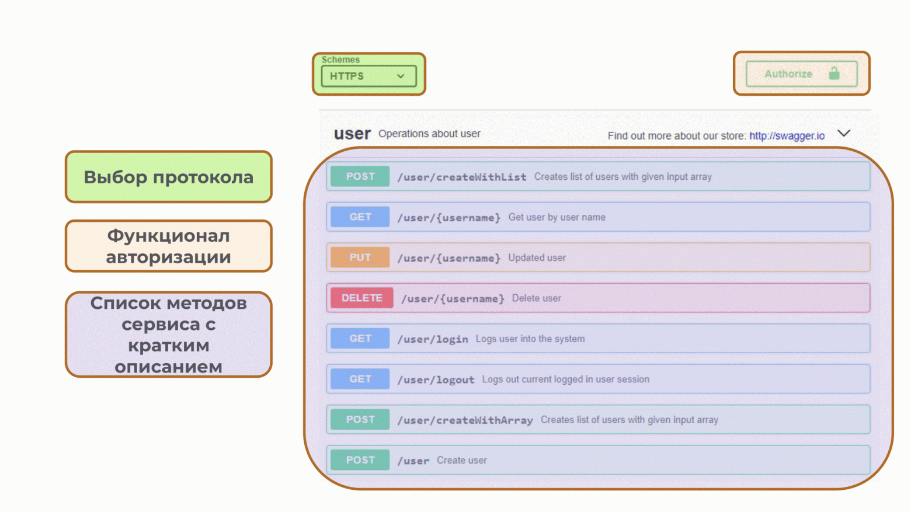

# Swagger

**Swagger** - это открытый стандарт (OpenAPI) для описания, документирования и тестирования веб-API. Он позволяет разработчикам легко создавать документацию для своих API, а тестировщикам и аналитикам проверять работоспособность API.

В стандартный функционал Swagger входит: отправка запросов, просмотр ответов, возможность посмотреть готовые примеры запросов и ответов, варианты авторизации, возможность экспорта ответа в файл и генерация cURL запроса.

<figure><figcaption>
Функционал Swagger
</figcaption></figure>

## Достоинства

1. Это, как правило, полностью готовые инструменты, в которых уже созданы все обращения к эндпойнтам, тела запросов и другие параметры.&#x20;
2. Они очень быстры и просты в освоении и использовании из-за элементарного функционала.&#x20;
3. Содержат примеры ответов и описание приходящих в них параметров.&#x20;
4. Не требуют установки на устройство пользователя, они уже развернуты на стенде.&#x20;
5. Генерируют cURL, который можно приложить к баг-репорту, чтобы разработчик мог быстрее воспроизвести  баг и исправить его.&#x20;

## Недостатки

1. Они хранят только заранее прописанные разработчиком параметры запросов, которые могут быть избыточными или наоборот, неполными.&#x20;
2. Нельзя сохранять свои параметры запросов. То есть после обновления страницы сваггероподобной системы пропадет все, что вы туда ввели. Таким образом, параметры запросов, использующиеся в тест-кейсах, придется хранить в отдельных документах, а это неудобно.
3. Нельзя создавать коллекции запросов, так как невозможно сохранять свои варианты запросов.
4. Нельзя создавать скрипты-проверки, ожидаемый результат с фактическим придется сверять глазами/руками.
5. Невозможны прогоны, то есть автоматизированный последовательный запуск запросов.
6. Нельзя создавать и использовать никакие окружения, переменные.&#x20;
7. Полезность описаний в сваггероподобных системах очень разнится от проекта к проекту.

## Когда использовать

Так как это не инструмент тестирования, а интерактивная документация по API, такие системы чаще используются для ознакомления с эндпойнтами и исследовательских проверок.&#x20;

Источник:&#x20;

* [https://habr.com/ru/articles/733868/](https://habr.com/ru/articles/733868/)
* [https://habr.com/ru/companies/simbirsoft/articles/675878/](https://habr.com/ru/companies/simbirsoft/articles/675878/)
