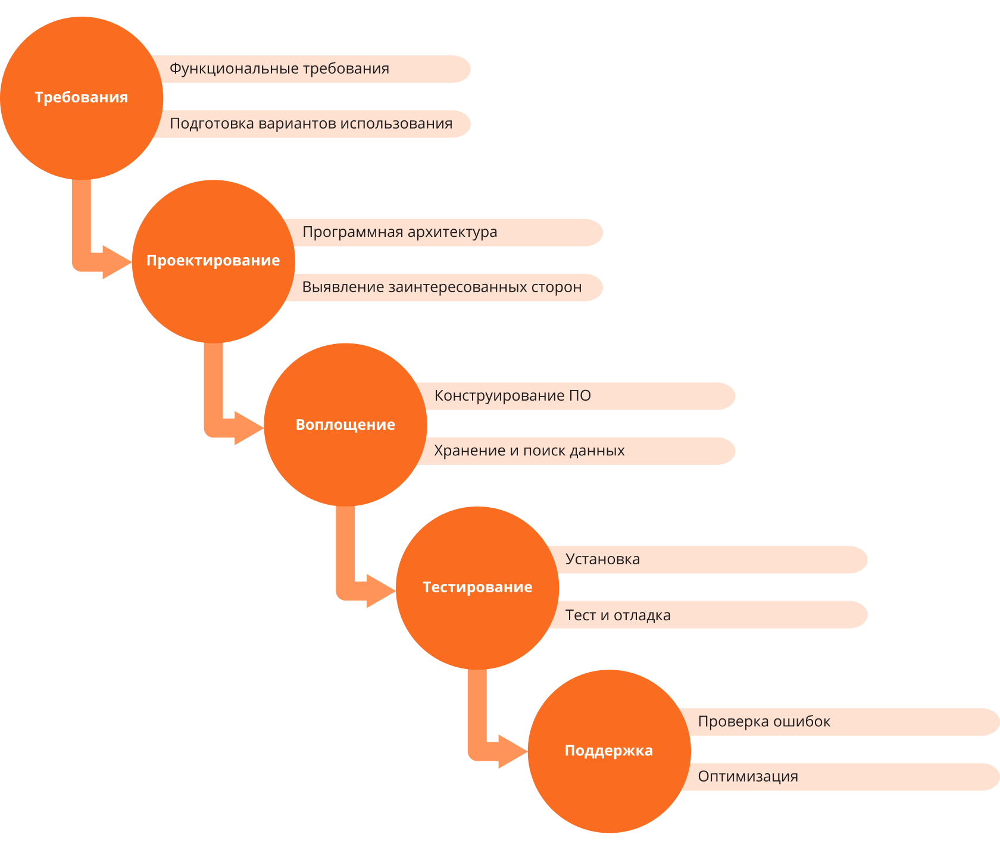

# Waterfall

<figure><figcaption></figcaption></figure>

Одна из самых старых, подразумевает последовательное прохождение стадий, каждая из которых должна завершиться полностью до начала следующей. В модели Waterfall легко управлять проектом. Благодаря её жесткости, разработка проходит быстро, стоимость и срок заранее определены. Но это палка о двух концах. Каскадная модель будет давать отличный результат только в проектах с [четко и заранее определенными требованиями](http://www.edsd.ru/ru/uslugi/poektirovanie) и способами их реализации. Нет возможности сделать шаг назад, тестирование начинается только после того, как разработка завершена или почти завершена. Продукты, разработанные по данной модели без обоснованного ее выбора, могут иметь недочеты (список требований нельзя скорректировать в любой момент), о которых становится известно лишь в конце из-за строгой последовательности действий. Стоимость внесения изменений высока, так как для ее инициализации приходится ждать завершения всего проекта. Тем не менее, фиксированная стоимость часто перевешивает минусы подхода. Исправление осознанных в процессе создания недостатков возможно, и, по нашему опыту, требует от одного до трех дополнительных соглашений к контракту с небольшим ТЗ.

Истчоник: [https://habr.com/ru/companies/edison/articles/269789/](https://habr.com/ru/companies/edison/articles/269789/)

<figure><figcaption></figcaption></figure>

Классическая поэтапная методология, в которой каждый следующий шаг начинается только после завершения предыдущего. В отличие от Agile каскадная модель не допускает изменений в этапах разработки.

#### Преимущества

_Постоянный контроль процессов и предсказуемость._ Цели и задачи проекта понятны для разработчиков и не вызывают дополнительных вопросов.

_Оценка затрат и сроков до начала проекта._ Все требования четко проговариваются на начальном этапе и не изменяются в течение всего процесса. Предсказуемость позволяет точно оценить будущие расходы.

_Документация каждого этапа._ Это позволяет создавать базу для других проектов и предоставлять отчетность заказчику в любое время.

#### Недостатки

_Сложно исправить ошибки._ Тестирование проходит только на последних этапах разработки, поэтому возможные недочеты необходимо предусмотреть заранее.

_Отсутствие обратной связи от заказчика на протяжении большей части проекта._ Заказчик принимает участие в обсуждении целей проекта и возвращается, чтобы оценить финальный результат, который может его полностью не удовлетворить.

_Высокая стоимость исправлений._ Любая ошибка приведет к необходимости переделывать весь проект. Избежать подобных проблем помогают сильные и дорогие бизнес-аналитики, которые способны точно перевести задачи бизнеса на ИТ язык.

#### Где применяется

Каскадная модель используется при реализации проектов по жизнеобеспечению, где любая ошибка может привести к фатальным последствиям. «Водопад» предпочитают также военные и воздушные организации, в которых необходимы строгие требования к выполнению проектов. Подобная модель может применяться при разработке программного обеспечения для дорожных светофоров. На начальном этапе проект необходимо согласовать с заказчиком и прописать всю документацию. После этого будет выбрана архитектура, создан код, проведено тестирование, осуществлена интеграция и проверка на ошибки. Каждый из этих этапов будет строго следовать один за другим.

Источник: [https://stecpoint.ru/Practices-Methodologies/](https://stecpoint.ru/Practices-Methodologies/)
