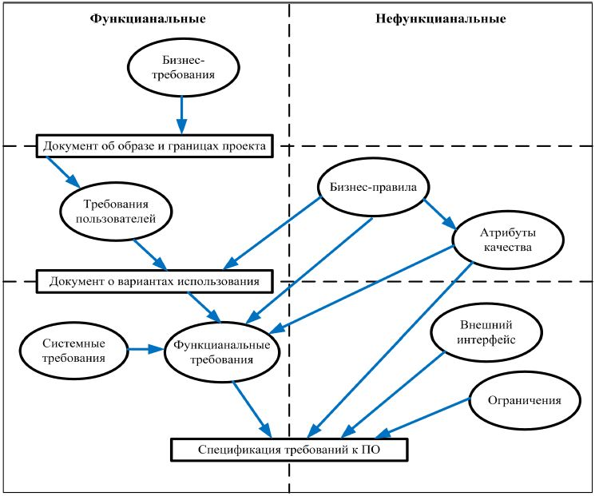

# 📍 Требования

## Вопросы на которые ответим:

* Что такое требование к ПО?
* Какие видыя требований бывают?
* Чем отличаются бизнес-требования от функциональных?
* Чем отличаются функциональные требования от нефункциональных?
* Чем отличаются пользовательские требования от функциональных?
* Привести примеры каждого из требований или классифицировать предложенные требования.
* Какие критерии качества требований бывают?

## Общее


"Я думаю о требованиях, как о свойствах, которыми должен обладать продукт, чтобы представлять какую-то ценность для пользователей"\
\
Карл И. Вигерс


<figure><figcaption>
Схема требований
</figcaption></figure>
