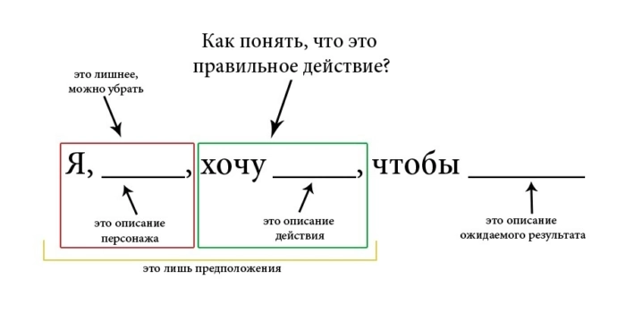
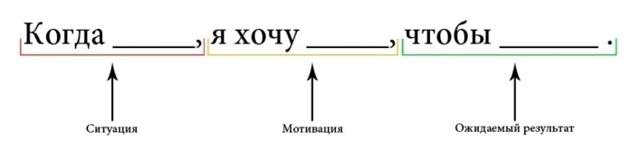

# 📎 Job story


User Story описывают функциональность продукта с точки зрения пользователя, а Job Story — выявляют одинаковые мотивы поведения разных людей в конкретных ситуациях.


User story неплохой подход, используемый много лет, но он имеет существенный недостаток: при передаче данных теряется множество важных нюансов. Разработчики не знают, почему пользователи ведут себя так, как ведут, чем они интересуются и что их мотивирует на совершение тех или иных действий.

Для создания успешного продукта разработчики должны понимать, что определяет поведение человека, какие у него есть проблемы и мотивация. Для создания удобного интерфейса (хотя этот метод не ограничен одним направлением деятельности) используют Job Stories.

## User story vs Job story

<figure><figcaption>
Концепция User story
</figcaption></figure>

<figure><figcaption>
Концепция Job Story
</figcaption></figure>

## Формат записи Job story

Когда \[ситуация],\
я хочу \[мотивация],\
чтобы \[ожидаемый результат].

**Job Story состоит из трех частей:**

1. **Контекст** — описание ситуации, в которой у человека возникает затруднение или проблема.
2. **Мотивация** — что должно произойти, чтобы человек избавился от проблемы? Здесь описывается как человек видит себе решение проблемы, а не то, что вы хотите от него добиться. Это не конкретный продукт и не фичи.
3. **Желаемый прогресс** — почему или для чего человек хочет решить проблему? Когда человек найдет решение проблемы, как улучшится его жизнь? Какие возможности у него появятся, которых не было раньше, если проблема решиться?

## Пример

Когда \[я захожу на незнакомый интернет-магазин и он вызывает подозрение], \
я хочу \[узнать можно ли ему доверять], \
чтобы \[не оставить им платежные данные и не стать жертвой обманщиков].

Когда \[я переехал в незнакомый город или страну], \
я хочу \[завести рабочие знакомства с интересными людьми], \
чтобы \["забустить" свой бизнес].

Когда \[пытаюсь найти ВУЗ, но тону в море информации об учебных заведениях и факультетах из разных источников], \
я хочу \[сопоставить свои возможности (предметы, баллы, бюджет) и предложение на рынке образования (учебные заведения, специальности)], \
чтобы \[не пропустить неочевидную возможность].

Источники:&#x20;

* [https://vc.ru/productstar/148852-kak-job-stories-pomogut-v-sozdanii-krutogo-interfeysa](https://vc.ru/productstar/148852-kak-job-stories-pomogut-v-sozdanii-krutogo-interfeysa)
* [https://habr.com/ru/companies/friifond/articles/260457/](https://habr.com/ru/companies/friifond/articles/260457/)
* [https://glubina.studio/blog/gajd-po-job-stories](https://glubina.studio/blog/gajd-po-job-stories)
