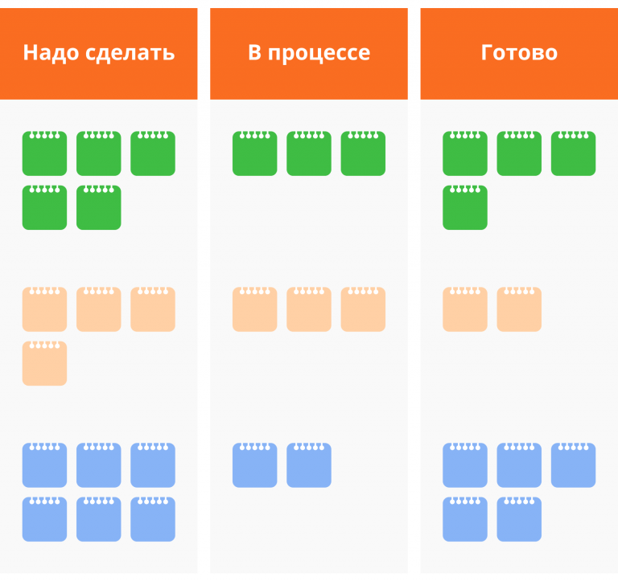

# Kanban


**Kanban** - подход к разработке ПО по методике Agile, который подразумевает открытость всех рабочих процессов и постоянное улучшение производительности. Каждый член команды выполняет индивидуальный набор задач.


<figure><figcaption>
Цикл разработки по Kanban
</figcaption></figure>

## Преимущества

* Наглядная визуализация задач на Канбан-доске.
* Высокая концентрация на текущей работе. Команда фокусируется на конкретной задаче и направляет все усилия на ее решение. Приоритетность задач может меняться.
* Быстрое устранение проблем. Все члены команды могут отслеживать прогресс и давать обратную связь, которая помогает оперативно исправлять ошибки.
* Оптимизация издержек. Канбан позволяет анализировать и прогнозировать точное время, необходимое для реализации проекта.

## Недостатки

* Не удовлетворяет требованиям больших команд. Метод не предназначен для групп численностью больше 5 человек, и команд, где сотрудники не знают функции друг друга. В таких условиях невозможно эффективно контролировать реализацию проекта.

Главное преимущество Канбана это Канбан-доска, на которой четко видно в каком состоянии находится задача и, что не мало важно, сколько задача находится в таком состоянии. В связи с чем, на данный момент Канбан зачастую используется как приложение к Scrum, просто для визуализации бэклога спринта.&#x20;

Источник: [https://stecpoint.ru/Practices-Methodologies/](https://stecpoint.ru/Practices-Methodologies/)
