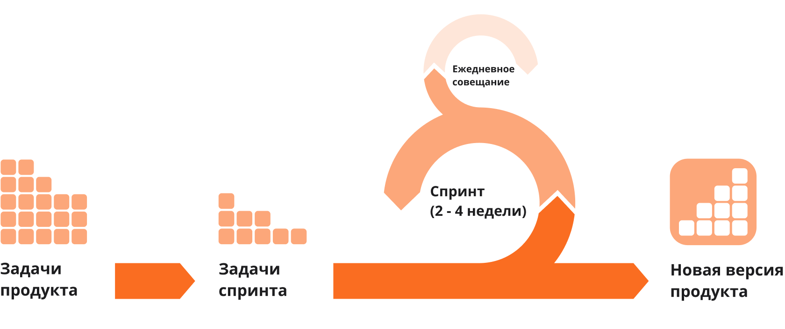

# Scrum

Если Agile – это принципы и философия, то Scrum – это набор конкретных правил и регламентов, которые говорят о том, как именно организовывать работу.&#x20;


**Scrum** – модель управления разработкой с гибкой организацией работы внутри команды, направленной на создание новых сложных продуктов. Scrum позволяет развивать проект в тесном сотрудничестве с заказчиком, постоянно корректируя характеристики продукта и показывая результат на каждом этапе разработки.


<figure><figcaption>
Цикл разработки по Scrum
</figcaption></figure>

## Scrum роли в команде

* Product owner – управляет бэклогом. Backlog – набор требований, которые надо реализовать для того, чтобы продукт был готов. Задачи product owner собрать BackLog, сделать его понятным для команды, выставить приоритеты. Backlog постоянно обновляется в зависимости от текущих целей разработки.
* Scrum master – координирует команду. Специалист по Scrum, досконально знает этапы, церемонии, артефакты Scrum разработки. Зачастую эту роль выполняет Product owner.
* Development team – команда разработки (разработчики, аналитики, тестировщики). Люди должны быть кросс-функциональны, т.е. иметь унифицированные компетенции (каждый должен уметь делать все).

## Scrum события

* **Sprint** – время, за которое создается инкремент продукта — готовый для конечного пользователя продукт. Само часто встречающиеся по длине спринты - это 1 или 2 недели.&#x20;
* **Планирование Sprint’а** – на этой встрече решается, каким будет инкримент, и как организовать работу, чтобы успеть сделать все задачи. Целью планирования является формирование бэклога спринта из бэклога продукта. В планировании спринта участвуют все члены Scrum команды.
* **Ежедневные митинги (daily meeting)** – встречи, на которых обсуждается, что сделано за предыдущий день, что будет делаться сегодня, какие проблемы мешают достижению целей спринта.
* **Обзор спринта (Sprint review meeting)** — встреча с подведением итогов спринта, демонстрация инкремента продукта для product owner или заказчика. В обзоре спринта участвуют все члены Scrum команды.
* **Ретроспектива** – на нем высказываются о прошедшем спринте: что было сделано хорошо, то надо улучшить в следующем спринте. Чаще всего проходит в рамках Sprint review meeting.
* **Груминг (Grooming)** – это процесс в разработке ПО, который помогает уточнять и приоритезировать задачи в проекте. Он включает в себя команду участников, которые создают и анализируют задачи или пользовательские истории в беклоге проекта, а затем определяют, какие из них являются наиболее важными или должны быть выполнены первыми.

## Преимущества

* Простота внедрения методологии в команду
* Эффективное взаимодействие между участниками проекта. Процесс принятия решений полностью зависит только от членов команды. Все внутренние процессы регулируют сами разработчики. Это позволяет всем участникам проекта четко понимать свои функции и задачи.
* Возможность быстрого запуска проекта с наиболее приоритетными функциями и минимально возможным бюджетом.
* Ежедневный контроль над ходом работ, и более гибкий контроль над бюджетом проекта.
* Малую вероятность провала разработки из-за частых совещанием с заказчиком продукта.
* Возможность вносить коррективы в техническое задание по ходу реализации проекта.

## Недостатки

* Большое количество совещаний. (порядка 15-20% рабочего времени)
* Необходимость кросс-функциональности команды с высокой квалификацией.
* Сложности при заключении договоров. Scrum в принципе не подразумевает наличие фиксированного бюджета и фиксированного технического задания, что затрудняет юридическое оформление такого рода договоренностей.

## Где используется

Scrum подходит для проектов, где важно быстро предоставлять результаты работы и иметь возможность отреагировать на изменения в процессе разработки. А ещё благодаря многообразию совещаний и способов делегировать задачи эту систему удобно применять, когда некоторые члены команды не знакомы с контекстом продукта.

Источники:

* [https://vc.ru/u/752307-karina-gorbunova/218436-kanban-agile-scrum-lean-gibkie-metodologii-razrabotki](https://vc.ru/u/752307-karina-gorbunova/218436-kanban-agile-scrum-lean-gibkie-metodologii-razrabotki)
* [https://stecpoint.ru/Practices-Methodologies/](https://stecpoint.ru/Practices-Methodologies/)
* [https://agaltsovav.ru/docs/development-managment/grooming/](https://agaltsovav.ru/docs/development-managment/grooming/)
